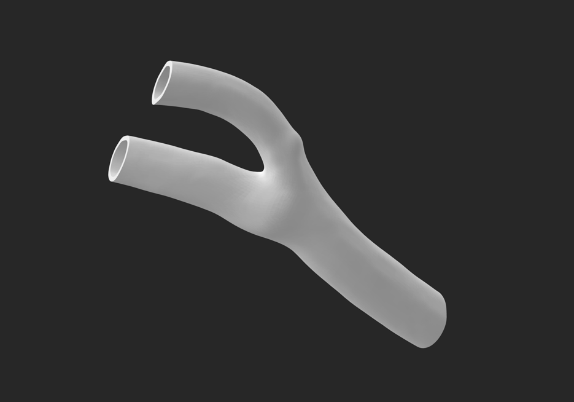

# Carotid Artery Hemodynamic Analysis

**University of Arizona | 2025**

---

## Overview

A dual-method study combining **computational fluid dynamics (CFD) simulation** and **physical flow visualization** to investigate blood flow patterns, pressure distribution, and wall shear stress in the carotid artery under rest, moderate exercise, and intense exercise conditions. Findings have direct implications for understanding atherosclerosis risk and vascular health.

---

## Methods

Two complementary approaches were used in parallel:

**Computational (ANSYS Fluent CFD)**
- Applied steady-state Navier-Stokes equations to model blood flow through an anatomical carotid bifurcation geometry
- Blood modeled as a Newtonian fluid: density 1051.5 kg/m³, dynamic viscosity 4×10⁻³ Pa·s
- Inlet boundary conditions set to uniform velocity at the base of the common carotid artery; zero-pressure outlets at terminal branches; no-slip condition on artery walls
- Mesh element size 0.0001 m with adaptive sizing level 4; minimum mesh orthogonality of 0.187
- Simulations run to steady-state convergence for all three flow conditions

**Physical (Flow Visualization)**
- Anatomical STL model sourced from Thingiverse, repaired and remeshed in Meshmixer (patched geometry defects, scaled diameter to 12 mm / length 70.9 mm), 3D printed in clear PLA on an Ultimaker S3

- Model placed in a 6"×6" cross-section flow tank; stabilized with clamps
- Fluorescent dye injected at the inlet under blacklight illumination with a black background to maximize contrast
- Video captured on iPhone 13 Pro and analyzed frame-by-frame in ImageJ to estimate flow velocity and quantify separation regions

---

## Simulation Conditions

| Condition | Inlet Velocity | Reynolds Number (CFD) | Reynolds Number (Experimental) |
|---|---|---|---|
| Rest | 0.3 m/s | 474 | ~125 |
| Moderate exercise | 0.45 m/s | 711 | ~134 |
| Intense exercise | 0.6 m/s | 947 | ~157 |

---

## Key Results

**Flow behavior**
- Laminar flow confirmed across all three conditions in both CFD and physical experiments — Re remained well below the turbulent threshold of 2000
- Flow separation consistently observed in the carotid sinus across all conditions; separation region size increased gradually with velocity
- Helical flow pattern identified at the bifurcation apex and downstream in the OCA across all exercise levels
- At higher flow speeds, inertial forces increasingly dominated over viscous forces, producing a more direct flow path through the vessel

**Wall shear stress (CFD)**
- Low WSS consistently localized to the carotid sinus — a known risk region for atherosclerotic plaque formation
- High WSS concentrated at the bifurcation apex and at inlet/outlet vessel cross-sections
- WSS magnitude increased with exercise intensity across all regions

**Velocity and pressure (CFD)**
- Velocity magnitude peaked outside the carotid sinus; reversed flow observed within the sinus at rest
- Pressure highest at the inlet and decreased progressively toward the outlets
- Vorticity magnitude highest near vessel walls and at the downstream end of the sinus

**Physical visualization**
- Low-velocity residual dye region in the carotid sinus measured at ~0.0053 m at intense exercise conditions using ImageJ
- Experimental Reynolds numbers (125–158) lower than CFD values (474–947) due to geometric scaling of the physical model; scaling behavior characterized and reported

---

## My Contributions

- **CFD simulation** — configured and ran all three ANSYS Fluent steady-state simulations; set boundary conditions, mesh parameters, and extracted velocity, pressure, and WSS outputs
- **Mesh preprocessing** — imported anatomical STL into Meshmixer; remeshed, patched geometry defects, and scaled to experimental dimensions
- **Physical model fabrication** — 3D printed hollow clear PLA carotid bifurcation model on Ultimaker S3; removed support material post-print
- **Flow visualization apparatus** — designed and operated the dye injection setup with blacklight illumination and controlled background
- **ImageJ analysis** — analyzed recorded footage frame-by-frame to quantify flow velocity and measure low-flow separation region dimensions
- **Cross-method correlation** — compared experimental and computational Reynolds numbers to characterize model scaling behavior and validate findings

---

## Tools & Technologies

`ANSYS Fluent` `Meshmixer` `ImageJ` `SolidWorks` `Ultimaker S3` `Python` `3D printing`

---

## Background

The carotid artery bifurcation — where the common carotid splits into the internal and external carotid arteries — is a primary site for atherosclerotic plaque development. Regions of low wall shear stress and disturbed flow, particularly within the carotid sinus, are associated with endothelial dysfunction and lipid deposition. Understanding how exercise-induced increases in flow velocity alter these hemodynamic conditions provides insight into vascular health and the protective effects of physical activity.

---

## Limitations & Future Work

- CFD assumed Newtonian fluid behavior and steady-state flow; blood is non-Newtonian and pulsatile in reality
- Physical model Reynolds numbers differed from CFD due to geometric scaling constraints of the flow tank
- Future work could incorporate pulsatile inlet conditions, non-Newtonian viscosity models, pathological geometries (stenosis, plaque), and particle image velocimetry (PIV) for higher-resolution experimental validation
